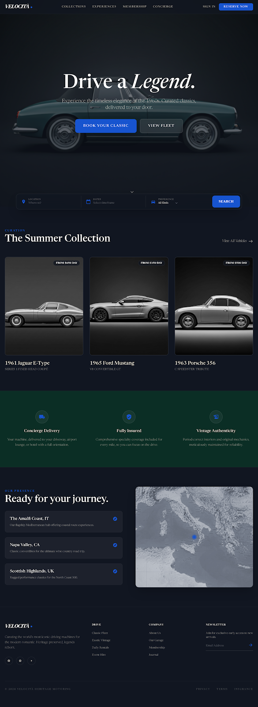

# VELOCITÀ 🏎️

> **A high-performance vehicle showcase platform built with Node.js & Express.**



## 📌 Table of Contents

- [About the Project](#-about-the-project)
- [Key Features](#-key-features)
- [Tech Stack](#-tech-stack)
- [Getting Started](#-getting-started)
  - [Prerequisites](#prerequisites)
  - [Installation](#installation)
  - [Environment Variables](#environment-variables)
  - [Running the Application](#running-the-application)
- [Project Structure](#-project-structure)
- [License](#-license)

---

## 📖 About the Project

**Velocità** is a modern web application designed to showcase a premium fleet of vehicles. Originally conceptualized as a Symfony project, this iteration has been refactored into a standalone **Node.js** architecture, emphasizing performance, clean code, and a streamlined development workflow.

The application leverages the **MVC (Model-View-Controller)** pattern to ensure separation of concerns and maintainability. It dynamically renders content using **EJS** templates and serves a responsive, visually striking frontend.

---

## ✨ Key Features

- **🚀 High Performance**: Built on the lightweight and fast Node.js runtime.
- **🎨 Dynamic Rendering**: Server-side rendering with EJS for SEO-friendly pages.
- **📱 Responsive Design**: Fully responsive layout optimized for all devices.
- **🔧 MVC Architecture**: Clean code structure separating logic, data, and presentation.
- **🔌 API Integration**: Fetches fleet data seamlessly via a dedicated service layer.

---

## 🛠 Tech Stack

### Backend
- **Node.js**: JavaScript runtime environment.
- **Express.js**: Fast, unopinionated web framework for Node.js.
- **Dotenv**: Zero-dependency module for environment variable management.

### Frontend
- **EJS (Embedded JavaScript)**: Efficient templating engine.
- **CSS3 / HTML5**: Modern styling and semantic markup.
- **JavaScript (ES6+)**: Interactive client-side logic.

---

## 🚀 Getting Started

Follow these steps to set up the project locally.

### Prerequisites

Ensure you have the following installed:
- [Node.js](https://nodejs.org/) (v16 or higher recommended)
- [npm](https://www.npmjs.com/) (usually comes with Node.js)

### Installation

1. **Clone the repository:**
   ```bash
   git clone https://github.com/belou16/VELOCIT-
   cd velocita
   ```

2. **Install dependencies:**
   ```bash
   npm install
   ```

### Environment Variables

Create a `.env` file in the root directory to configure the application. You can use the example below:

```ini
# .env
PORT=3000
API_URL=http://localhost:8000/api # Example API URL if applicable
```

### Running the Application

**Development Mode:**
Runs the server with `nodemon` for hot-reloading.
```bash
npm run dev
```

**Production Mode:**
Starts the server normally.
```bash
npm start
```

Open your browser and navigate to: `http://localhost:3000`

---

## 📂 Project Structure

```bash
VELOCITÀ/
├── 📂 backend/         # Backend logic storage (if applicable)
├── 📂 node_modules/    # Project dependencies
├── 📂 src/             # Source code
│   ├── 📂 controllers/ # Request handlers (e.g., homeController.js)
│   ├── 📂 models/      # Data models
│   ├── 📂 public/      # Static assets (CSS, JS, Images)
│   ├── 📂 services/    # Business logic & API services
│   ├── 📂 views/       # EJS Templates
│   │   ├── 📂 partials # Reusable view components
│   │   └── index.ejs   # Main landing page
│   └── app.js          # Application entry point
├── .gitignore          # Git ignore rules
├── package.json        # Project metadata & scripts
├── README.md           # Project documentation
└── screen.png          # Project screenshot
```

---

## 📄 License

This project is licensed under the **ISC License**.

---

Developed with ❤️ by **Armand**.
